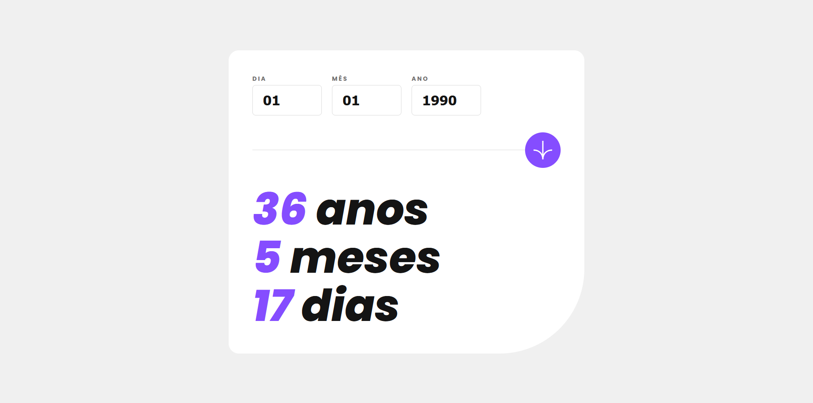
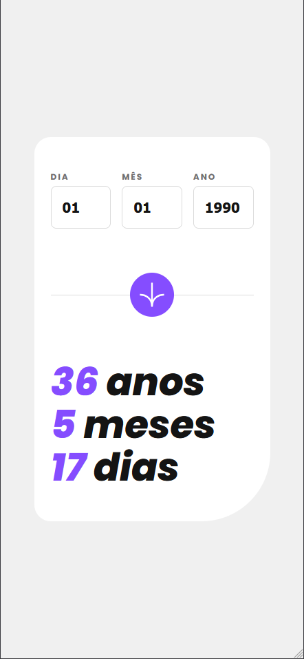

# Frontend Mentor - Solução do Aplicativo Calculadora de Idade

Esta é a minha solução para o [desafio do aplicativo Calculadora de Idade no Frontend Mentor](https://www.frontendmentor.io/challenges/age-calculator-app-dF9DFFpj-Q). Os desafios do Frontend Mentor ajudam a melhorar suas habilidades de codificação construindo projetos realistas.

## Sumário

- [Visão Geral](#visão-geral)
  - [O Desafio](#o-desafio)
  - [Captura de Tela](#captura-de-tela)
  - [Links](#links)
- [Meu Processo](#meu-processo)
  - [Tecnologias Utilizadas](#tecnologias-utilizadas)
  - [Análise do Código (Como funciona)](#análise-do-código-como-funciona)
- [Autor](#autor)

## Visão Geral

### O Desafio

Os usuários devem ser capazes de:
- Ver a idade em anos, meses e dias após enviar uma data válida pelo formulário.
- Receber erros de validação reativos se:
  - Qualquer campo estiver vazio ao enviar.
  - O número do dia não estiver entre 1 e 31.
  - O número do mês não estiver entre 1 e 12.
  - O ano estiver no futuro ou for inválido.
  - A data for inconsistente (ex: 31/04/1991, já que abril tem 30 dias).
- Ver o layout ideal para a interface dependendo do tamanho da tela do dispositivo (responsividade).
- Ver estados de hover e foco para todos os elementos interativos.

### Captura de Tela
#### Desktop


#### Mobile


### Links

- URL da Solução: [Frontend Mentor](https://your-solution-url.com)
- URL do Site Live: [Github Page](https://your-live-site-url.com)

## Meu Processo

### Tecnologias Utilizadas

- **HTML5** com tags semânticas e acessibilidade (`aria-label`).
- **CSS3** com Custom Properties (Variáveis), Flexbox e Media Queries.
- [Angular](https://angular.dev/) (V17+) - Framework Web estrutural.
- **Angular Signals** (`signal`) - Para controle de estado reativo leve e síncrono.
- **Nova Sintaxe de Controle de Fluxo (`@if`)** - Para tratamento condicional de erros no template.

---

### Análise do Código (Como funciona)

O projeto foi estruturado separando a lógica de validação matemática, a reatividade do template e a responsividade visual.

#### 1. Lógica e Reatividade (TypeScript + Signals)
No componente principal, utilizei **Signals** para capturar a digitação em tempo real e gerenciar de forma limpa as mensagens de erro e os resultados finais. A validação executa em cascata (Campos vazios ➡️ Valores individuais ➡️ Consistência do calendário ➡️ Verificação de futuro):

```typescript
// Exemplo da lógica de validação de consistência do calendário e cálculo
const birthDate = new Date(y, m - 1, d);
const isDateCombinationValid = 
  birthDate.getFullYear() === y && 
  birthDate.getMonth() === m - 1 && 
  birthDate.getDate() === d;

if (!isDateCombinationValid) {
  this.dayError.set('Deve ser uma data válida');
  return;
}

// Cálculo exato ajustando meses e dias negativos
let years = today.getFullYear() - birthDate.getFullYear();
let months = today.getMonth() - birthDate.getMonth();
let days = today.getDate() - birthDate.getDate();

if (days < 0) {
  months--;
  const previousMonth = new Date(today.getFullYear(), today.getMonth(), 0);
  days += previousMonth.getDate();
}
```

#### 2. Lógica e Reatividade (TypeScript + Signals)
O template utiliza a vinculação de propriedades do Angular para ler os Signals e a nova estrutura ``@if``para renderizar as mensagens de erro condicionalmente, sem inflar a árvore do DOM com diretivas complexas:

```HTML
<div class="input-group">
    <label for="day" [class.error-label]="dayError()">DIA</label>
    <input type="text" id="day" [value]="day()" (input)="day.set($any($event.target).value)" placeholder="DD"
        maxlength="2" inputmode="numeric" autocomplete="off" pattern="[0-9]*" [class.error-input]="dayError()">
    @if (dayError()) {
        <p class="error-message">{{ dayError() }}</p>
    }
</div>
```

#### 3. Estilização e Responsividade (CSS)
A estilização foi feita aplicando o conceito *Mobile-First*. O aplicativo se adapta perfeitamente de uma visualização compacta travada em 343px no mobile para uma estrutura expandida e elegante de 840px em telas desktop usando Media Queries de largura mínima (min-width). Detalhes de usabilidade também foram adicionados, como desativar o destaque de toque indesejado em navegadores mobile:

```CSS
/* Mobile base com comportamento fluído e otimização de toque */
.submit-btn {
  touch-action: manipulation;
  -webkit-tap-highlight-color: transparent;
  transition: background-color 0.2s ease;
}

/* Transição cirúrgica para Desktop */
@media (min-width: 768px) {
  .card {
    max-width: 840px;
    padding: 56px;
    border-radius: 24px 24px 200px 24px;
  }
  .results-container h1 {
    font-size: 104px;
  }
}
```

## Autor
- Frontend Mentor - [@priscyladepaula](https://www.frontendmentor.io/profile/priscyladepaula)
- Linkedin - [@priscyladepaula](https://www.linkedin.com/in/priscyladepaula/)